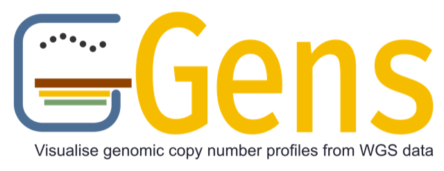
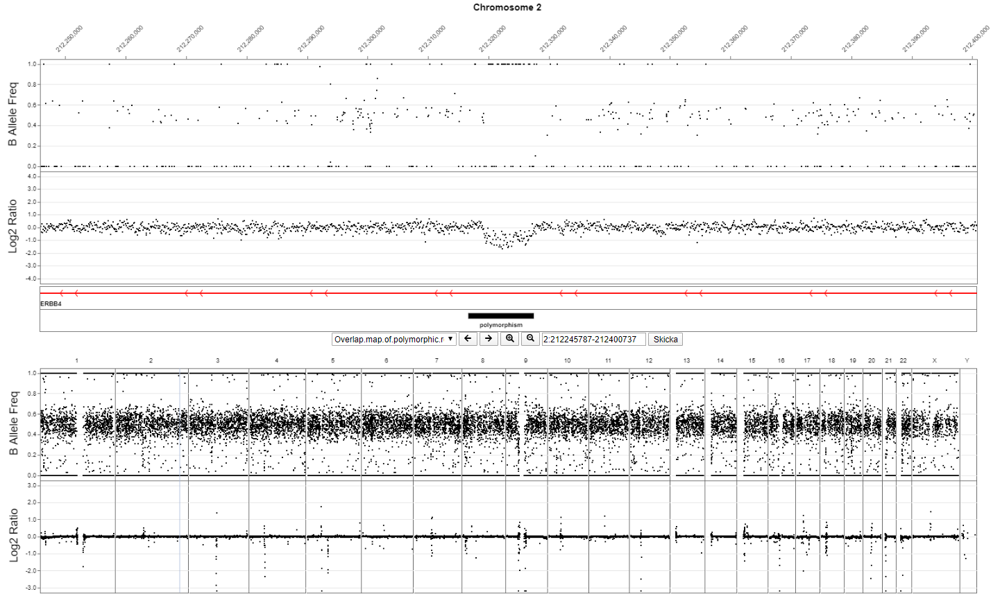

<p align="center">
  
</p>

[](https://www.codefactor.io/repository/github/clinical-genomics-lund/gens)
[](https://coveralls.io/github/Clinical-Genomics-Lund/gens?branch=master)

## About

**Gens** is a web-based interactive tool to visualize genomic copy number profiles from WGS data (although it could theoretically be used for any type of data). It plots the normalized read depth and alternative allele frequency. It currently does not attempt to visualize breakpoint information, so use IGV for that! The way we generate the data it is suitable for visualizing CNVs of sizes down to a couple Kbp, for smaller things use IGV!

This screenshot shows an 8 Kbp deletion (known polymorphism). Sorry about the boring screenshot, but we cannot show identifiable data.


## Installation

Gens requires python 3.5 or later and mongodb. For testing/development purposes the easiest way to install it is to create a virtual environment:

``` bash
git clone https://github.com/Clinical-Genomics-Lund/Gens.git
cd Gens
virtualenv -p python3 venv
source venv/bin/activate
pip install -r requirements.txt
```

You also need to build the javacript and css files and put them into the directory `gens/static/js` and `gens/static/css` respectively. To build the assets you need to have node installed on your system.
``` bash
# install build dependancies and build web assets.
npm install && npm run build
# copy built assets gens/static
cp -r build/{js,css} gens/static/
```

Start the application using:
``` bash
export FLASK_APP=gens.py && flask run
```

Make sure the application is running by loading http://localhost:5000/ in your web browser.

Finally you need to populate the databases with chromosome sizes and gene/transcript data using the scripts `utils/update_chromsizes.py` and `utils/update_transcripts.py`. (TODO: Add more details here!)

### Docker image

A simple demo and development instance of Gens can be launched either with the command `docker-compose run -d` or `make up`. It only require Docker to be installed. The first time you start Gens run `make init` to populate the database with chromosome size and transcripts. Gens requires access to a directory where the `xxx.baf.bed.gz` and `xxx.cov.bed.gz` files are stored. This can be achived by mounting the directory to `/access/wgs`, see sample docker-compose below.

``` yaml
services:
  gens:
    volumes:
      - /fs1/results/wgs/plotdata:/access/wgs/hg19  # /path/on/host:/path/inside/container
      - /fs1/results/wgs/plot_data:/access/wgs/hg38
```

The repository contains a Makefile with common docker-compose shortcuts for interacting with the containerized Gens app. To see the full list of shortcuts use the command `make help`.

The dockerized app consists of 2 containers, the Gens app and a lightweight mongodb instance.

Once the server has started you can open the app in your web browser at [http://localhost:5003](http://localhost:5003).

To stop the instance use the command `docker-compose down`.

## Setup Gens

Once installed you can load annotation data into Gens database using the included command line interface. 

``` bash
gens load --help
```

Gens requires the chromosome sizes to be loaded into the database. The repository includes the sizes for grch37 and grch38 in the utils folder.

To display transcripts these need to be loaded into the database.

``` bash
# download reference files
curl --silent --output ./Homo_sapiens.GRCh38.101.gtf.gz ftp://ftp.ensembl.org/pub/release-101/gtf/homo_sapiens/Homo_sapiens.GRCh38.101.gtf.gz
gzip -df Homo_sapiens.GRCh38.101.gtf.gz
curl --silent --output ./MANE.GRCh38.v0.92.summary.txt.gz ftp://ftp.ncbi.nlm.nih.gov/refseq/MANE/MANE_human/release_0.92/MANE.GRCh38.v0.92.summary.txt.gz
gzip -df MANE.GRCh38.v0.92.summary.txt.gz
# load files into database
gens load transcripts --file Homo_sapiens.GRCh38.101.gtf --mane MANE.GRCh38.v0.92.summary.txt -b 38
```

Annotated regions can be loaded into the database in either `bed` or `aed` format.

## Data generation

Gens uses a custom tabix-indexed bed file format to hold the plot data. This file can be generated in any way, as long as the format of the file is according to the specification (see the section "Data format"). This section describes the method we're using to create the data.

We are using the GATK4 workflow for normalizing the read depth data. It is described in detail here: https://gatk.broadinstitute.org/hc/en-us/articles/360035531092?id=11682. But here is a short summary of what we're doing:

### Create PON

Create targets file:
``` bash
gatk PreprocessIntervals                            \
     --reference GRCh38.fa                          \
     --bin-length 100                               \
     --interval-merging-rule OVERLAPPING_ONLY       \
     -O targets_preprocessed_100bp.interval_list
```

Build a panel of normals (PON). First run this command for all bam files that you want to include in the PON. We have one PON for males and one for females. We have approx. 100 individuals of each sex in the PONs, but less should be fine.
``` bash
gatk CollectReadCounts                                  \
    -I sample1.bam                                      \
    -L targets_preprocessed_100bp_bins.interval_list    \
    --interval-merging-rule OVERLAPPING_ONLY            \
    -O hdf5/sample1.hdf5
```

Then build the PON. This is fairly memory intensive, so make sure you have enough memory and adjust the -Xmx if necessary.
``` bash
gatk --java-options "-Xmx120000m" CreateReadCountPanelOfNormals \
     --minimum-interval-median-percentile 10.0                  \
     --maximum-chunk-size 29349635                              \
     -O male_pon_100bp.hdf5                                     \
     -I hdf5/sample1.hdf5                                       \
     -I hdf5/sample2.hdf5                                       \
     ...
     -I hdf5/sample99.hdf5
```

### Calculate normalized read depth data

Then in your pipeline. Use these commands to count and normalize the data of a sample:

``` bash
gatk CollectReadCounts                                              \
    -I subject.bam -L targets_preprocessed_100bp_bins.interval_list \
    --interval-merging-rule OVERLAPPING_ONLY -O subject.hdf5

gatk --java-options "-Xmx30g" DenoiseReadCounts                     \
    -I subject.hdf5 --count-panel-of-normals male_pon_100bp.hdf5    \
    --standardized-copy-ratios subject.standardizedCR.tsv           \
    --denoised-copy-ratios subject.denoisedCR.tsv
```

### Generate BAF data

It is possible to use the GATK tools to create BAF data as well, but we've found it to be very slow and since we are already doing (germline) variant calling, we extract the BAF data from the gVCF using the script provided in the **utils** directory.

### Reformatting the data for Gens

Once you have the standardized coverage file from GATK and a gVCF you can create Gens formatted data files using the command below. The script should accept any properly formatted gVCF but only output from GATK HaplotypeCaller and Sentieon DNAscope have been tested.

``` bash
utils/generate_gens_data.pl subject.standardizedCR.tsv subject.gvcf SAMPLE_ID gnomad_hg38.0.05.txt.gz
```

The script requires that **bgzip** and **tabix** are installed in a $PATH directory.

The final output should be two files named: **SAMPLE_ID.baf.bed.gz** and **SAMPLE_ID.cov.bed.gz**

## Loading data into Gens

Load a sample into gens with the command `gens load sample` where you need to specify the sample id, genome build and the generated data files. **Note** that there sample id/ genome build combination needs to be unique. To use Gens simply navigate to the URL **hostname.com:5000/** to view a list of all samples loaded into Gens. To directly open a specific sample go to the URL **hostname.com:5000/<sample id>**.

## Data format

If you want to generate the data in some other way than described above you need to make sure the data conforms to these standards.

Two data files for each sample are needed by Gens. One file for normalized read depth data, and one for B-allele frequencies (BAF). Both are normal bed files, with the exception that they have 5 different precalculatad levels of resolution. The different resolutions are represented in the bed-file by prefixing the chromosome names with **o**, **a**, **b**, **c**, **d** followed by an underscore. Over represents the data for the static overview, where **a** represent the lowest interactive resolution and **d** the highest.

Each region in the bed file represents a single point in the plot (so it should be only 1 bp wide). The distance between the data points is what differs between the different resolutions. To create the data for lower resolutions we use a midpoint mean for read depth data, and simply take every Xth value for BAF.

```
o_1    1383799    1383800    -0.081
o_1    1483799    1483800    -0.120
...
a_1    1379199    1379200    -0.048
a_1    1404199    1404200    -0.088
...
b_1    1388999    1389000    0.018
b_1    1393999    1394000    -0.108
...
c_1    1386399    1386400    -0.136
c_1    1387399    1387400    -0.050
...
d_1    1386849    1386850    -0.340
d_1    1386949    1386950    -0.312
```

The fourth column values should be log2-ratio values (log2(depth/average depth)) for the read depth data and allele frequencies between 0.0 and 1.0 for BAF data.

The bin size for each resolution could be anything, but the if they are too small there will be too many points to load in a view (making things slow), if they are too big the points will be too sparse. Here are the bin sizes we're using:

| resolution level | bin size | # data points | # SNPs (BAF)     |
|------------------|----------|---------------|------------------|
| o                | 100,000  | 28,000        | 47,000           |
| a                | 25,000   | 110,000       | 188,000          |
| b                | 5,000    | 550,000       | 754,000          |
| c                | 1,000    | 2,700,000     | 1,900,000        |
| d                | 100      | 26,400,000    | 7,500,000        |


The **o** resolution is used only for the whole genome overview plot. The number of data points in this resolution really affects the time it takes to initially load a sample into Gens.

### Selection of SNPs for BAF data

We're using all SNPs in gnomAD with an total allele frequency > 5%, which in gnomAD 2.1 is approximately 7.5 million SNPs.

### Loading reference tracks

Gens allows adding multiple tracks, most easily provided in one directory. As an illustration, here is how to format a UCSC DGV bb track for Gens display.

Download the DGV bb track from [UCSC](https://genome.ucsc.edu/cgi-bin/hgTables?db=hg19&hgta_group=varRep&hgta_track=dgvPlus&hgta_table=dgvMerged&hgta_doSchema=describe+table+schema).
Convert bigBed to Bed, cut relevant columns and name them according to Gens standard.
```
./bigBedToBed /home/proj/stage/rare-disease/gens-tracks/dgvMerged.bb dgvMerged.bed
cut -f1,2,3,4,9 dgvMerged.bed > dgvMerged.fivecol.bed
cat > header
Chromosome	Start	Stop	Name	Color
cat header dgvMerged.fivecol.bed > /home/proj/stage/rare-disease/gens-tracks/DGV_UCSC_2023-03-09.bed
```

```
us
conda activate S_gens
gens load annotations -b 37 -f /home/proj/stage/rare-disease/gens-tracks
```

This should result in something like:
```
[2023-12-15 14:45:06,959] INFO in app: Using default Gens configuration
[2023-12-15 14:45:06,959] INFO in db: Initialize db connection
[2023-12-15 14:45:07,111] INFO in load: Processing files
[2023-12-15 14:45:07,112] INFO in load: Processing /home/proj/stage/rare-disease/gens-tracks/Final_common_CNV_clusters_0.bed
[2023-12-15 14:45:07,144] INFO in load: Remove old entry in the database
[2023-12-15 14:45:07,230] INFO in load: Load annoatations in the database
[2023-12-15 14:45:07,309] INFO in load: Update height order
[2023-12-15 14:45:10,792] INFO in load: Processing /home/proj/stage/rare-disease/gens-tracks/DGV_UCSC_2023-03-09.bed
[2023-12-15 14:45:16,170] INFO in load: Remove old entry in the database
[2023-12-15 14:45:16,173] INFO in load: Load annoatations in the database
[2023-12-15 14:45:41,873] INFO in load: Update height order
Finished loading annotations ✔
```

## Limitations

- Currently no efforts have been made to make it work for non-human organisms. Chromosome names are currently hardcoded to 1-23,X,Y.

## Browser compatibility

This table lists the browsers and versions where Gens has been tested and deemed to be functional. The versions are by no means the minimum required version, but rather the earliest versions we've tested Gens in since starting this table.

| Browser | Functional | Versions | Issues |
|---------|------------|----------|--------|
| Chrome  | YES        | >=87     |        |
| Firefox | YES        | >=84     |        |
| Edge    | YES        | >=87     |        |
